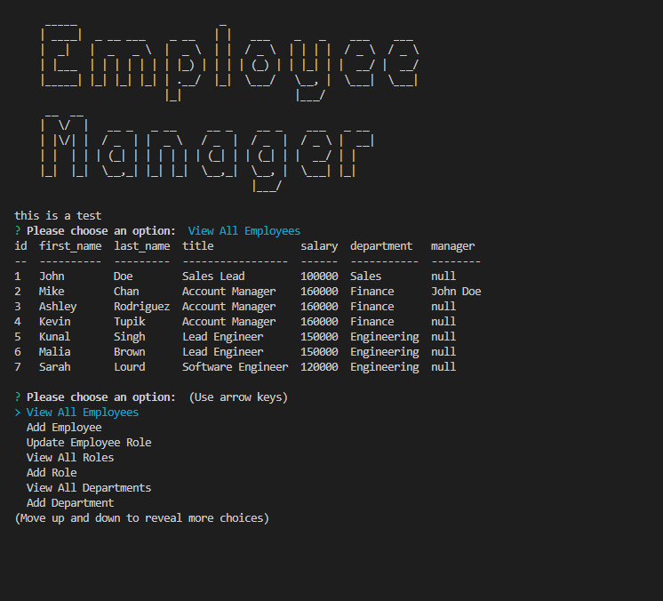

# 12_SQL_Employee_Tracker

## Description
This is a Node.js/MySql command-line application that allows company's  to manage a employee database. You are also able to view and manage the departments, roles, and employees in my company.

## Table of Contents (Optional)

- [Installation](#installation)
- [Usage](#usage)
- [Credits](#credits)
- [License](#license)

## Installation

1. Download or clone repo
2. Install nodejs https://nodejs.org/en/download/
3. Run npm i in terminal while under the repo directory
4. Create a .env file in the root of this project folder and then add following to it:
    - DB_USERNAME = '[an admin username]'
    - DB_PASSWORD = '[that user's password]'
5. In the terminal login to msql while in project directory
    - Run 'source db/schema.sql'
    - Run 'source db/seeds.sql'
    - Run 'exit'

## Usage

- GIVEN a command-line application that accepts user input when you start the application then you am presented with the following options: view all departments, view all roles, view all employees, add a department, add a role, add an employee, and update an employee role.
- When you choose to view all departments then you are presented with a formatted table showing department names and department ids.
- When you choose to view all roles then you are presented with the job title, role id, the department that role belongs to, and the salary for that role.
- When you choose to view all employees then you are presented with a formatted table showing employee data, including employee ids, first names, last names, job titles, departments, salaries, and managers that the employees report to.
- When you choose to add a department then you are prompted to enter the name of the department and that department is added to the database.
- When you choose to add a role then you are prompted to enter the name, salary, and department for the role and that role is added to the database.
- When you choose to add an employee then you are prompted to enter the employee’s first name, last name, role, and manager, and that employee is added to the database.
- When you choose to update an employee role then you are prompted to select an employee to update and their new role and this information is updated in the database.

Provide instructions and examples for use. Include screenshots as needed.

To add a screenshot, create an `assets/images` folder in your repository and upload your screenshot to it. Then, using the relative filepath, add it to your README using the following syntax:

    

## DEMO

[Demo](https://drive.google.com/file/d/15iOsOQgWx325M83MpKQMe6ANJh-sCCjv/view)
## Credits

- [Inquirer](https://www.npmjs.com/package/inquirer)
- [MySQL](https://www.mysql.com/)
- [mysql2](https://www.npmjs.com/package/mysql2)
- [dotenv](https://www.npmjs.com/package/dotenv)
- [Console Table](https://www.npmjs.com/package/console-table)

## License

MIT License

Copyright (c) 2022 Taja Jones

Permission is hereby granted, free of charge, to any person obtaining a copy
of this software and associated documentation files (the "Software"), to deal
in the Software without restriction, including without limitation the rights
to use, copy, modify, merge, publish, distribute, sublicense, and/or sell
copies of the Software, and to permit persons to whom the Software is
furnished to do so, subject to the following conditions:

The above copyright notice and this permission notice shall be included in all
copies or substantial portions of the Software.

THE SOFTWARE IS PROVIDED "AS IS", WITHOUT WARRANTY OF ANY KIND, EXPRESS OR
IMPLIED, INCLUDING BUT NOT LIMITED TO THE WARRANTIES OF MERCHANTABILITY,
FITNESS FOR A PARTICULAR PURPOSE AND NONINFRINGEMENT. IN NO EVENT SHALL THE
AUTHORS OR COPYRIGHT HOLDERS BE LIABLE FOR ANY CLAIM, DAMAGES OR OTHER
LIABILITY, WHETHER IN AN ACTION OF CONTRACT, TORT OR OTHERWISE, ARISING FROM,
OUT OF OR IN CONNECTION WITH THE SOFTWARE OR THE USE OR OTHER DEALINGS IN THE
SOFTWARE.
---
## Badges

